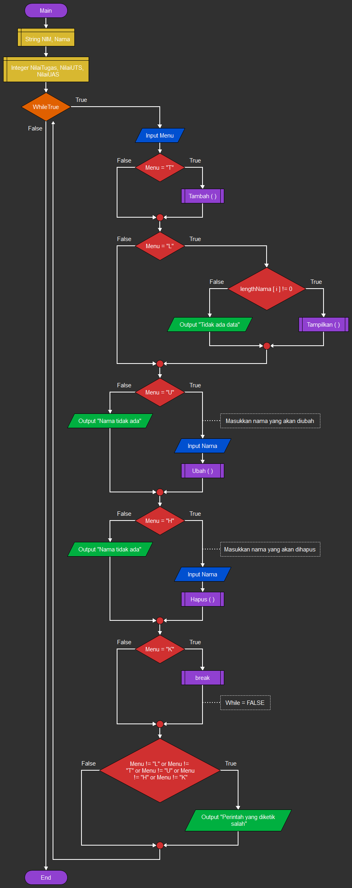

# Latihan membuat function python  

* Nama          : Hizbullah Ridwan
* NIM           : 312110055
* Kelas         : TI.21.C.1
* Mata Kuliah   : Bahasa Pemrograman
----------------------------------
Dalam latihan membuat function [`python`](https://www.python.org/) ini, saya menggunakan [`PyCharm`](https://www.jetbrains.com/pycharm/) sebagai teks editornya.     
    
* [Latihan](https://github.com/Ridwanwildan/Dictionary-Python#latihan)         
* [Tugas](https://github.com/Ridwanwildan/Dictionary-Python#tugas)        

## Latihan      

Latihan mengubah function biasa menjadi `lambda function`. Ini merupaka function sebelum diubah ke lambda function :          
```bash
import math

def a(x):
    return x**2

def b(x, y):
    return math.sqrt(x**2 + y**2)

def c (*args):
    return sum(args)/len(args)

def d(s):
    return "".join(set(s))
```              
Ini yang sudah diubahnya :             
```bash
import math

a = lambda x: x**2

b = lambda x, y: math.sqrt(x**2 + y**2)

c = lambda *args: sum(args)/len(args)

d = lambda s: "".join(set(s))
```         

## Tugas           

Buat program sederhana dengan mengaplikasikan penggunaan fungsi yang akan menampilkan daftar nilai mahasiswa, dengan ketentuan:             
* Fungsi `tambah()` untuk menambah data                
* Fungsi `tampilkan()` untuk menampilkan data                
* Fungsi `hapus(nama)` untuk menghapus data berdasarkan nama                
* Fungsi `ubah(nama)` untuk mengubah data berdasarkan nama                

         